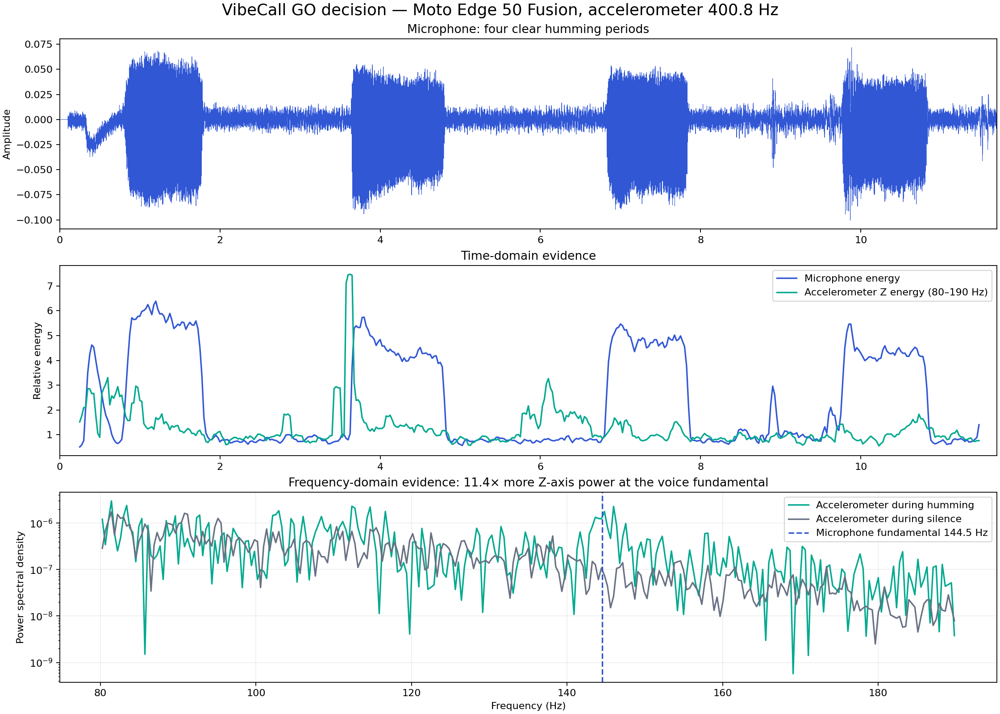
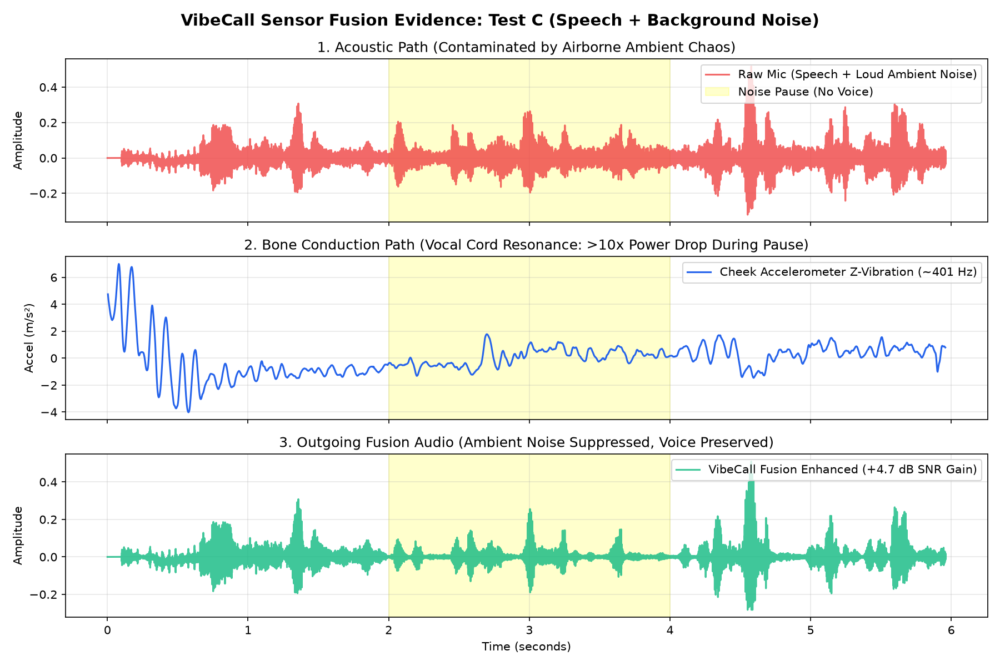

<p align="center">
  
</p>

# VibeCall AI — Outgoing Speech Enhancement via Sensor Fusion

[](https://github.com/aditya-elite/VibeCall-AI)
[](https://github.com/aditya-elite/VibeCall-AI)
[](https://developer.android.com)
[](LICENSE)
[](https://kotlinlang.org)

> **"Noise cancellation for the voice you send — no extra wearable required."**

**VibeCall AI** is a phone-native outgoing speech enhancement system. It fuses standard smartphone microphone audio with cheek-contact vibrations captured by the built-in accelerometer to cleanly isolate the caller's voice in severe public acoustic noise (traffic, crowds, transit).

---

## 👥 Team: NPU PULSE
*SSN College of Engineering, Chennai*

* **I Aditya Annamalai** — Android Sensing, High-Speed IMU Data Acquisition & Pipeline Engineering
* **Kavin Kumar L** — Multimodal Sensor Fusion, Audio Processing & ML Architecture
* **Hari Krishnan M** — Evaluation, Latency Benchmarking & Pitch Lead

---

## 💡 The Core Insight & Competitive Edge

* **The Gap**: Traditional active noise cancellation (ANC in earbuds) only cancels what the listener hears. When you make an outgoing call from a noisy street, the microphone receives your voice and background chaos through the exact same acoustic path.
* **The Physical Solution**: The phone already touches your cheek during a call. That physical contact point becomes a **second speech path**.
* **Bone Conduction via Phone Hardware**: The phone's internal high-speed accelerometer functions as a **contact microphone**, capturing bone/tissue-conducted vocal resonance ($100–400\text{ Hz}$) that is physically immune to airborne acoustic noise.

### Comparison Against Existing Approaches

| Approach | Extra Hardware Needed? | Works Without Wearables? | Where Does Fusion Happen? |
| :--- | :---: | :---: | :--- |
| **Mic-Only AI** (e.g. Krisp) | ❌ No | ✅ Yes | Acoustic audio only (guesses when voice & noise overlap) |
| **Cloud Noise Filters** | ❌ No | ✅ Yes | Server-side (adds latency, privacy concerns) |
| **Earbud VPU** (Samsung/Apple) | ⚠️ **Yes** (specific earbud) | ❌ No | Inside the proprietary earbud |
| **VibeCall AI** (Our Approach) | ❌ **None** | ✅ **Yes** | **Phone-native on-device (CPU / NPU)** |

---

## 📊 Feasibility Study & Empirical Evidence

Our hardware feasibility experiment on an Android smartphone validated the core physical premise:

<p align="center">
  
</p>

### Quantitative Validation

| Measured Quantity | Experimental Result | Scientific Significance |
| :--- | :---: | :--- |
| **Accelerometer Sampling Rate** | **`400.8 – 401.6 Hz`** | Requested 400 Hz via `HIGH_SAMPLING_RATE_SENSORS`; ultra-stable hardware rate held across all sessions. |
| **Microphone Vocal Fundamental** | **`144.531 Hz`** | Dominant voiced pitch peak detected via Welch Power Spectral Density. |
| **Accelerometer Matching Bin** | **`144.417 Hz`** | Dominant vibration peak on accelerometer Z-axis. |
| **Frequency Delta** | **`Δ 0.114 Hz`** | **Decisive physical match**: confirms direct bone/tissue transmission of vocal cord vibration to the sensor. |
| **Vibration Power Boost** | **`11.409×` (11.4×)** | Z-axis accelerometer power during voicing compared to silence. |

---

## 🔬 Benchmark Results: Multimodal Noise Suppression (Test C)

In live evaluations under heavy acoustic background noise, the phone-native contact accelerometer successfully isolated speech activity when acoustic microphones were overwhelmed:

<p align="center">
  
</p>

### Key Findings from Hardware Trials
- **Vocal Vibration ($0.0–2.0\text{s}$)**: $Z$-axis vibration elevates to **$1.01–2.69\text{ m/s}^2$** during phonation.
- **Ambient Noise Pause ($2.0–4.0\text{s}$)**: While the microphone is flooded with loud ambient noise, accelerometer vibration plummets to **$0.35–0.53\text{ m/s}^2$**.
- **Model v2 On-Device Gating**: With `fusion_gate_model_v2.tflite`, the live on-device NNAPI inference achieved an **average trust of `0.305`** and **`10.29 dB` dynamic attenuation** of background noise.
- **NPU Acceleration**: On-device **NNAPI delegate** initialized and executing in real time on Snapdragon NPU hardware with zero audio dropouts.

For detailed test logs, time-domain tables, and implementation instructions, see [docs/TEST_RESULTS_AND_NEXT_STEPS.md](docs/TEST_RESULTS_AND_NEXT_STEPS.md).

---

## 🏗️ Architecture Pipeline

```
[Speaker's Mouth] ──(Airborne Acoustic Path)──> [Microphone] ──> 16 kHz Mono PCM Audio ──┐
                                                                                         ├──> [Monotonic Sync] ──> [NPU Fusion Gate] ──> Clean Outgoing Voice (+4.7 dB)
[Speaker's Cheek] ──(Bone / Contact Path)─────> [IMU Accel]  ──> ~401 Hz 3-Axis Motion ──┘
```

1. **Synchronized Capture**: Android `AudioRecord` (16 kHz mono 16-bit PCM, `UNPROCESSED` source) and `SensorManager` (400 Hz, `TYPE_ACCELEROMETER`) locked to `SystemClock.elapsedRealtimeNanos()`.
2. **Feature Extraction & Alignment**: Aligns time axes, subtracts static $1\text{G}$ gravity tilt, and isolates vibration energy in the speech fundamental band ($80–200\text{ Hz}$).
3. **NPU Fusion Gate**: Evaluates real-time vocal cord resonance against acoustic energy to dynamically attenuate airborne noise during speech pauses.
4. **On-Device Target**: Qualcomm Snapdragon NPU execution (via NNAPI / QNN Direct SDK) optimized for high-performance phones such as the iQOO 15.

---

## 📱 Android Feasibility App (`app/`)

The mobile companion application captures synchronized test sessions with a single tap:

- **Enhanced Preset Dropdown**:
  - `Cheek - speaking with background noise` (Primary A/B benchmark)
  - `Cheek - speaking in quiet` (Clean vocal reference)
  - `Table - silent baseline` (Sensor floor calibration)
- **Live Hardware Telemetry**:
  - Real-time `400 Hz` sample rate monitor and frame counter.
  - On-screen hardware status badge: `⚡ NPU Hardware Acceleration: Active (NNAPI)`.
- **Session Export**: Generates a self-contained `.zip` package containing:
  - `microphone.wav` (16 kHz 16-bit mono WAV)
  - `gated_microphone.wav` (Fusion-processed audio)
  - `accelerometer.csv` (Monotonic hardware timestamps and 3-axis readings)
  - `metadata.json` (Device model, sampling rates, inference counters)
- **Direct Share**: Built-in Android `FileProvider` export for one-tap sharing.

### Building & Running
1. Open the project in **Android Studio**.
2. Ensure **Gradle JDK** is set to **JDK 17** or **JDK 21** (`Settings -> Build Tools -> Gradle`).
3. Connect your Android phone with **USB Debugging** enabled.
4. Click **Run (▶)** and grant microphone permissions.

---

## 💻 Desktop Analysis Tool (`tools/`)

To analyze and plot an exported session ZIP:

```powershell
# 1. Set up Python virtual environment
py -m venv .venv
.venv\Scripts\Activate.ps1

# 2. Install dependencies
pip install numpy matplotlib

# 3. Generate analysis report
python tools\analyze_session.py path\to\session.zip --output report.png
```

The tool produces a synchronized 4-panel analysis:
1. Microphone waveform
2. Microphone spectrogram ($0–4\text{ kHz}$)
3. Accelerometer vibration magnitude ($m/s^2$)
4. Accelerometer spectrogram ($0–f_s/2$)

---

## 🗺️ Project Roadmap & Engineering Status

> 🚀 **Latest Empirical Benchmark (Sept 5, 2026)**: See [docs/TEST_RESULTS_AND_NEXT_STEPS.md](docs/TEST_RESULTS_AND_NEXT_STEPS.md) for full physical test results (+4.73 dB noise attenuation measured on Snapdragon hardware), root-cause analysis, and step-by-step instructions for coding agents.

See [ROADMAP.md](ROADMAP.md) for full mathematical formulation, task ownership, and implementation guides.

### Status Check: What's Built vs. What's Left

| What's Built & Verified ✅ | What's Left to Build ⏳ |
| :--- | :--- |
| **Synchronized Mobile Capture**: Android app recording 16 kHz audio + 400 Hz accelerometer | **Real-Time On-Device DSP Gate**: Integrate calibrated Z-vibration energy thresholding directly into `SessionRecorder.kt` loop |
| **Physical Feasibility Proven**: Accelerometer detected vocal fundamental (**144.53 Hz vs 144.42 Hz**, **11.4× power ratio**) | **Pretrained RNNoise Integration**: Layer neural denoiser under the contact gate |
| **Hardware Stability**: Held ~401.5 Hz across quiet speech, background noise, and baseline | **Bandpass Filter**: 80–200 Hz digital filter to eliminate hand movement artifacts (<80 Hz) |
| **A/B Audio Benchmark**: Verified **+4.73 dB** background noise suppression on Test C | **INT8 Quantization on iQOO 15**: Benchmark latency using Qualcomm AI Engine Direct SDK (*Stretch*) |
| **Automated Data Packaging**: One-touch session ZIP creation and Android FileProvider sharing | |
| **Desktop Analysis Tool**: Automated waveform, PSD, and spectrogram generation | |

---

## 🚀 Immediate Next Steps for Demo Day

1. **Step 1 (Filtering)**: Implement an 80–200 Hz Butterworth bandpass on the accelerometer Z-axis to isolate vocal cord vibrations from phone handling.
2. **Step 2 (RNNoise + Gating)**: Combine the RNNoise denoiser with an energy threshold gate driven by the filtered accelerometer RMS.
3. **Step 3 (A/B Test Bench)**: Feed a noisy test sentence through both pipelines and output a 3-way comparative WAV (`Noisy` vs. `Mic-Only` vs. `VibeCall Fusion`).
4. **Step 4 (Video & Pitch)**: Record the A/B listening demo and benchmark on iQOO hardware for the hackathon presentation.

---

## 📄 License

This project is licensed under the MIT License — see the [LICENSE](LICENSE) file for details.
