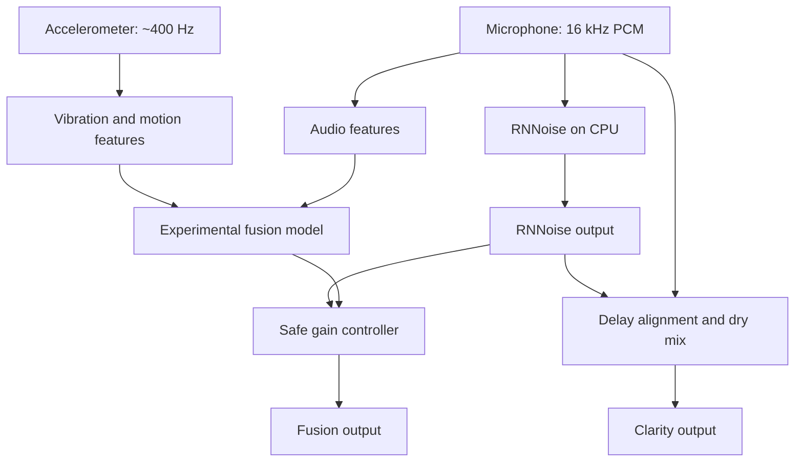

# VibeCall AI

**On-device outgoing-speech enhancement using microphone audio and phone-contact vibration experiments.**

VibeCall AI is an Android **record, process, and compare prototype** built for the iQOO Hackathon 2026. It records 16 kHz microphone audio alongside approximately 400 Hz accelerometer data, applies RNNoise, produces an optional speech-clarity track, and evaluates an experimental audio-vibration fusion controller.

> Current scope: this repository is not a live phone-call integration. It is an on-device experimental app for synchronized capture, processing, playback comparison, telemetry, and session export.

## Current status

| Capability | Status | Evidence-based result |
|---|---|---|
| Synchronized microphone and accelerometer capture | Verified | 16 kHz mono PCM audio and approximately 400 Hz accelerometer capture on iQOO 15 (`I2501`, Android 16) |
| RNNoise processing | Verified | Runs on CPU and produces a distinct `microphone_rnnoise.wav` output with zero recorded processing failures in the latest controlled sessions |
| Clarity output | Working, experimental | Adds conservative raw/RNNoise mixing, presence EQ, speech-aware gain, and limiting; recent sessions reported zero clipped samples |
| Fusion feature extraction | Verified | Produces time-aligned microphone, vibration, motion, contact, reliability, and pitch-related features |
| CPU fusion inference | Verified, experimental | Explicitly labelled CPU/XNNPACK mode; recent controlled tests completed all inferences with zero failures |
| Fusion improvement over RNNoise | **Not demonstrated** | In the latest three controlled tests, Fusion remained byte-identical to RNNoise because the safe controller preserved gain at `1.0` |
| Physical NPU execution | **Unavailable through NNAPI** | Native enumeration exposed only `nnapi-reference` (CPU); mandatory-NPU mode disables inference and fails open safely |

Detailed measurements and limitations are documented in [`docs/TEST_RESULTS_AND_NEXT_STEPS.md`](docs/TEST_RESULTS_AND_NEXT_STEPS.md) and [`docs/iqoo_trial_summary.json`](docs/iqoo_trial_summary.json).

## Target Hardware: iQOO 15 Flagship

All empirical test sessions, audio recordings, sensor telemetry, and verification datasets in this repository were collected and verified on the official hackathon device:

| Hardware Attribute | Specification |
|---|---|
| **Device Model** | **iQOO 15 (`vivo I2501`)** |
| **Processor (SoC)** | **Qualcomm Snapdragon 8 Elite** (`SM8750-AB`, TSMC 3nm N3E, Oryon CPU) |
| **Operating System** | **Android 16** (API Level 36, Build `BP2A.250305.002`) |
| **IMU / Accelerometer** | **STMicroelectronics `lsm6dsvx`** (continuous 400.00 Hz non-wakeup sensor stream) |
| **Microphone Ingress** | 16 kHz 16-bit mono PCM (`VOICE_COMMUNICATION` platform mode & bit-exact `UNPROCESSED`) |
| **Deployment Bridge** | Live USB debugging via Vivo/iQOO Office Kit |

## Why combine audio and vibration?

Airborne background noise reaches the microphone, while speech may also produce mechanical vibration when the phone touches the speaker's cheek. VibeCall investigates whether the built-in accelerometer can provide complementary evidence about contact speech.

The recordings show that vibration and audio pitch can agree in selected voiced frames. However, the latest controlled dataset does **not** yet provide reliable frame-level separation between cheek speech, cheek silence, and away-from-cheek background. The sensor-fusion path is therefore presented as experimental research, not as proven voice isolation.

## Processing pipeline


```mermaid
flowchart TD
    A[Microphone: 16 kHz PCM] --> B[RNNoise on CPU]
    B --> C[RNNoise output]
    A --> D[Audio features]
    E[Accelerometer: ~400 Hz] --> F[Vibration and motion features]
    D --> G[Experimental fusion model]
    F --> G
    G --> H[Safe gain controller]
    C --> H
    H --> I[Fusion output]
    A --> J[Delay alignment and dry mix]
    C --> J
    J --> K[Clarity output]
```

The safety policy is deliberately conservative:

- Speech detected or evidence uncertain: gain remains `1.0`.
- Sensor unreliable, phone moving, model unavailable, or inference failure: gain remains `1.0`.
- Only a sustained, confidently detected pause may reduce gain.
- Gain transitions are smoothed to avoid clicks and chopped word endings.

## Output tracks

Every successful session exports the same-duration WAV tracks:

| File | Description |
|---|---|
| `microphone.wav` | Captured microphone track; its upstream Android processing depends on the selected recording mode |
| `microphone_rnnoise.wav` | CPU RNNoise baseline |
| `microphone_clarity.wav` | Experimental clarity track derived from aligned raw and RNNoise audio |
| `microphone_fusion.wav` | RNNoise multiplied by the experimental controller's smoothed, frame-dependent gain |
| `gated_microphone.wav` | Legacy fusion-gate comparison output retained for reproducibility |

Each exported ZIP also contains:

- `accelerometer.csv` — timestamped X/Y/Z sensor samples
- `features.csv` — synchronized audio-vibration features
- `fusion_decisions.csv` — confidence, controller state, gain, backend, latency, and decision reason per window
- `metadata.json` — device, capture, RNNoise, Clarity, Fusion, and acceleration-verification diagnostics

## App modes

### Platform Telephony — default

Uses `VOICE_COMMUNICATION` when available. Android or device-level voice processing and gain staging may already affect the captured microphone signal. Choose this mode for a stable communication-oriented demonstration.

### Fair RNNoise A/B

Requests `UNPROCESSED`, then falls back to `VOICE_RECOGNITION` or `MIC`, and attempts to disable platform acoustic effects. Choose this mode when comparing algorithms.

### CPU Fusion Demo — experimental, not NPU

Runs the 16-feature fusion model explicitly with CPU/XNNPACK for calibration and research. This option is disabled by default and is never labelled as NPU execution.

### Mandatory-NPU verification

The app uses native Android NNAPI device enumeration and rejects CPU/XNNPACK fallback in mandatory mode. On the tested iQOO 15, Android exposed only:

```text
nnapi-reference — CPU
```

Consequently, mandatory-NPU inference reports `NPU unavailable` and the controller preserves gain at `1.0`. Initializing an NNAPI delegate alone is not treated as proof of NPU execution. Qualcomm QNN/HTP integration requires the appropriate vendor SDK and remains future work.

## Build and run

### Requirements

- Android Studio with Android SDK 35
- JDK 17
- Android NDK `27.0.12077973`
- CMake 3.22.1
- iQOO 15 (`vivo I2501`) or compatible Android device with a microphone and accelerometer
- USB debugging for installation and log collection

### Windows

```powershell
git clone https://github.com/aditya-elite/VibeCall-AI.git
cd VibeCall-AI
./gradlew.bat testDebugUnitTest
./gradlew.bat assembleDebug
adb install -r app/build/outputs/apk/debug/app-debug.apk
```

### macOS or Linux

```bash
git clone https://github.com/aditya-elite/VibeCall-AI.git
cd VibeCall-AI
./gradlew testDebugUnitTest
./gradlew assembleDebug
adb install -r app/build/outputs/apk/debug/app-debug.apk
```

Launch **VibeCall Sensor Test**, grant microphone permission, choose a preset and recording mode, then record and audition the generated tracks.

## Reproducible recording protocol

For a short noisy comparison:

1. Hold the phone consistently against the cheek.
2. Play continuous background audio from a separate speaker.
3. Record approximately 15 seconds:
   - 0–3 seconds: background only
   - 3–12 seconds: speak the test sentence
   - 12–15 seconds: background only
4. Stop the external sound before playback.
5. Compare Raw, RNNoise, and Clarity at a consistent playback level.
6. Treat Fusion as experimental unless it beats RNNoise on a held-out recording without attenuating speech.

Suggested sentence:

> “Please meet me outside the railway station at six fifteen this evening.”

## Evaluation rules

A Fusion improvement should be claimed only on recordings excluded from calibration and only if it satisfies all of the following:

- Residual pause noise is reduced versus RNNoise.
- Speech level and intelligibility are preserved.
- No word endings are chopped.
- No clicks or clipped samples are introduced.
- An audio-only ablation is compared with audio-plus-accelerometer fusion, so any sensor contribution can be identified.

The latest controlled recordings do not yet satisfy this standard. Their features show substantial class overlap, so threshold tuning on those same recordings would risk overfitting.

## Desktop analysis and model tools

Create a Python environment and install the analysis requirements:

```powershell
py -m venv .venv
.venv\Scripts\Activate.ps1
pip install -r tools/requirements.txt
```

Useful commands:

```powershell
python tools/analyze_session.py path/to/session.zip --output report.png
python tools/analyze_iqoo_sessions.py
python tools/test_dataset_and_model.py
```

Model and dataset scripts are intended for experimentation. Generated metrics should be validated against held-out sessions before being reported as general performance.

## Repository structure

```text
app/                         Android application and unit tests
docs/                        Test history, plots, summaries, and NNAPI evidence
sessions/iqoo_sessions/      Exported on-device iQOO 15 experimental sessions
tools/                       Session analysis, dataset, and model-training utilities
ROADMAP.md                   Architecture and planned work
```

## Known limitations

- The app does not integrate with live telephony audio routing.
- RNNoise and Clarity are the stable demonstration paths; Clarity remains a subjective experimental enhancement.
- Current Fusion confidence does not reliably distinguish all tested contact and background conditions.
- Recent controlled Fusion outputs did not improve on RNNoise.
- NNAPI does not expose a non-CPU accelerator on the tested iQOO firmware.
- Results and empirical test sessions are recorded exclusively on the iQOO 15 (`vivo I2501`, Snapdragon 8 Elite, Android 16).

## Roadmap

1. Collect a larger labelled dataset across speakers, phone positions, and noise types on iQOO 15 hardware.
2. Improve vibration/contact features and perform session-held-out validation.
3. Retrain and calibrate the fusion model with explicit audio-only ablation tests.
4. Integrate Qualcomm QNN/HTP when a compatible SDK is available and verify the actual backend.
5. Explore real-time communication integration after the offline pipeline is reliable.

## Team

**DualDooms — SSN College of Engineering, Chennai**

- I Aditya Annamalai 
- Jeevan Sai V

## License

Licensed under the [MIT License](LICENSE).
